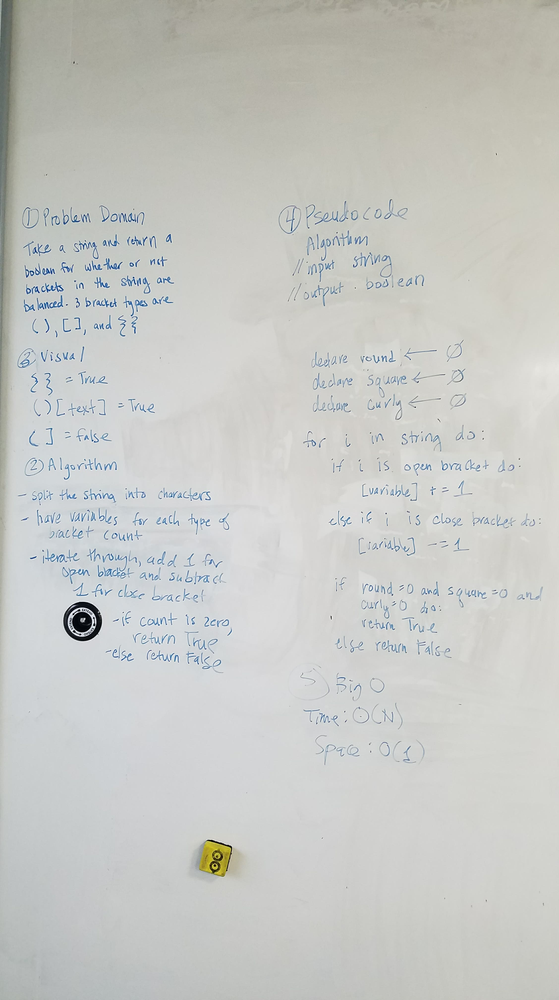

# Multi-bracket Validation
CF 401 Data Structures Whiteboard Challenge

## Challenge
Your function should take a string as its only argument, and should return a boolean representing whether or not the brackets in the string are balanced. There are 3 types of brackets:
- Round Brackets : ()
- Square Brackets : []
- Curly Brackets : {}

## Solution

