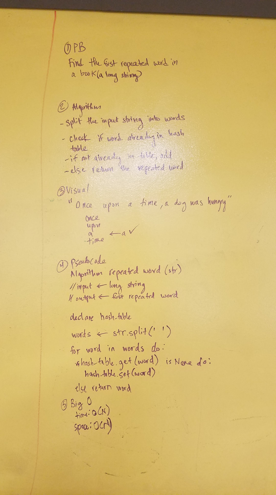

# Repeated Word
CF 401 Data Structures Whiteboard Challenge

Find the first repeated word in a book.

## Challenge
- Write a function that accepts a lengthy string parameter.
- Without utilizing any of the built-in library methods available to your language, return the first word to occur sequentially more than once in that provided string.
- Write at least three test assertions for each method that you define.

## Solution

