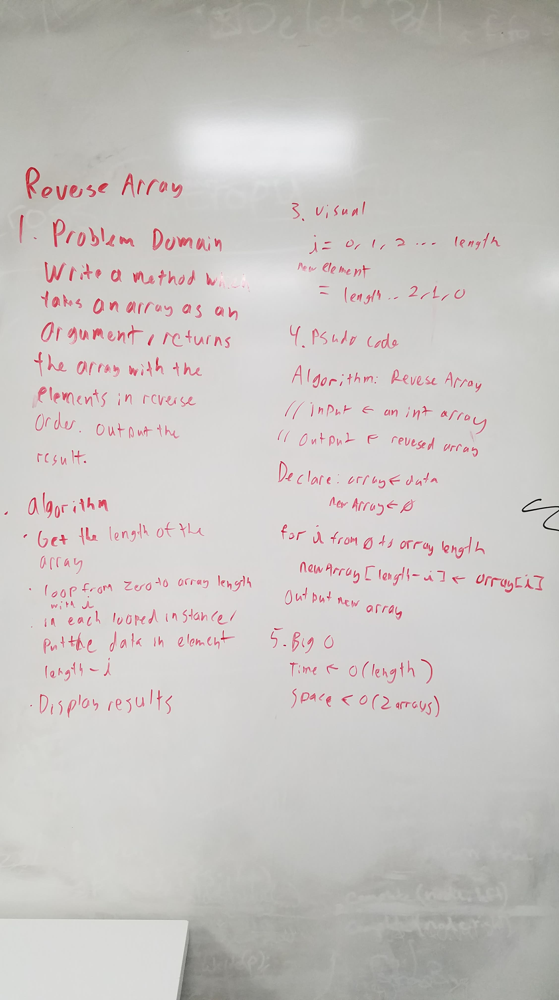

# Reverse an Array
CF 401 Data Structures Whiteboard Challenge

## Challenge
Write a function called reverseArray which takes an array as an argument. Without utilizing any of the built-in methods available to your language, return the provided array argument with elements in reversed order. Write at least three test assertions for each method that you define.

## Solution

<!-- Original Instructions:
Specifications
Read all of the following instructions carefully. Name things exactly as described, or you will get a ZERO without comment
Do all your work in a public repository called data-structures-and-algorithms, with a well-formated, detailed top level README.md matching the example provided by your instructor
Create a branch in your repository called reverse-an-array
On your branch, create a file called reverse-an-array, with the proper file extension for your programming language
Include any language-specific configuration files required for this challenge to become an individual component, module, library, etc.
NOTE: You can find an example of this configuration for your course in your class lecture repository.

Feature Tasks
Write a function called reverseArray which takes an array as an argument. Without utilizing any of the built-in methods available to your language, return the provided array argument with elements in reversed order.

Structure and Testing
Utilize the Single-responsibility principle: any methods you write should be clean, reusable, abstract component parts to the whole challenge. You will be given feedback and marked down if you attempt to define a large, complex algorithm in one function definition.

Write at least three test assertions for each method that you define.

Ensure your tests are passing before you submit your solution.

Stretch Goal
Once you've achieved a working solution, implement the same feature with a different methodology. (Hint: what different techniques do you have when working with arrays? Recursion, loops, indexes, …) -->
