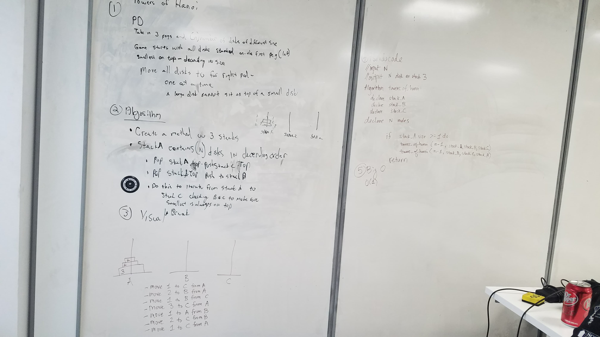

# Towers of Hanoi
CF 401 Data Structures Whiteboard Challenge

## Challenge
The Towers of Hanoi is a mathematical puzzle where you have 3 towers and N disks of different sizes.

The puzzle starts with the disks sorted (i.e. smaller disks sits on top of larger disks) on the left-most tower, and the objective of the puzzle is to move the disks to the right-most tower with the following restrictions:
- Only one disk can be moved at a given time.
- A disk is moved from the top of a tower to the top of another tower.
- A disk can’t be placed on top of a smaller disk.

## Solution

