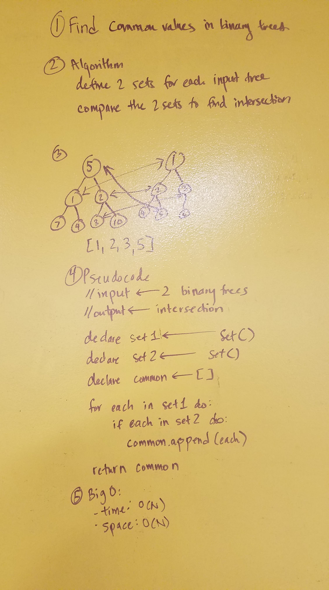

# Binary Search Tree

## Implement a Binary Search Tree

Create a Class or a Node which is aware of the value as val and left and right children as left and right respectively
- Ensure that you have a __repr__ and __str__ method defined to return appropriate representations of the node
Create a Class for a BST, which is aware of the root of the tree as root
- Ensure that you have a __repr__ and __str__ method defined to return appropriate representations of the tree
- This class should accept an iterable as an argument when initialized, such as [1, 2, 3, 4], which creates a tree from that argument
- This class should be aware of depth-first traversal methods for in_order, pre_order, and post_order traversals
- This class should have the ability to insert a new node into the tree. Your insertion should follow an O(log n) search solution to find the correct place for inserting the new node.

Ensure that your class and any subsequent methods are properly tested, and that your test coverage is above 80%.

### Whiteboard Challenge - Conduct “FizzBuzz” on a tree while traversing through it. Change the values of each of the nodes dependent on the current node’s value

- Write a function called FizzBuzzTree which takes a tree as an argument.
- Without utilizing any of the built-in methods available to your language, determine weather or not the value of each node is divisible by 3, 5 or both, and change the value of each of the nodes respectively. Return the tree with it’s news values.

### Whiteboard Challenge - Breadth-First Traversal

Write a function called breadthFirstTraversal which takes a Binary Tree as its unique input. Without utilizing any of the built-in methods available to your language, traverse the input tree using a Breadth-first approach; print every visited node’s value.

### Whiteboard Challenge - Find the Maximum Value in a Binary Tree

Write a function called find-maximum-value which takes binary tree as its only imput. Without utilizing any of the built-in methods available to your language, return the maximum value stored in the tree. You can assume that the values stored in the Binary Tree will be numeric.

### Whiteboard Challenge - Find common values in 2 binary trees
- Write a function called tree_intersection that takes two binary tree parameters.
- Without utilizing any of the built-in library methods available to your language, return a set of values found in both trees.
- Write at least three test assertions for each method that you define.

