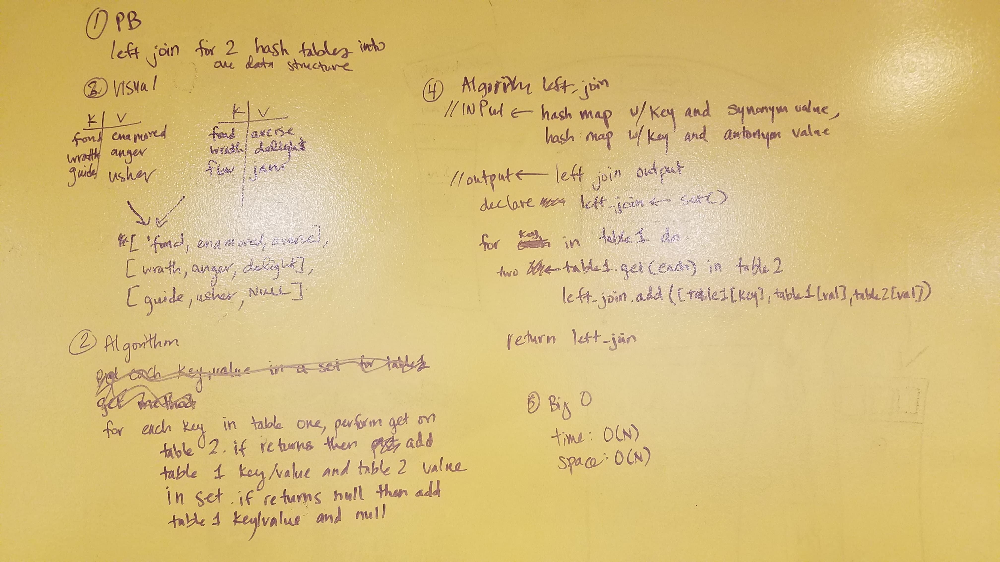

# Data Structures
## Hash Tables
- Create a HashTable class, which when instantiated is aware of the following attributes:
    - max_size: defaults to 1024
    - buckets: defaults to a Python list()
        - This list structure should be instantiated with a size of max_size, where each element is a LinkedList
- Define the following methods on your HashTable class:
    - hash_key: which accepts a string argument only, and returns a hashed value representing a single bucket location in your hash table
    - set: which accepts a key and value as arguments. The key will be used to as the hashed location for identifying a bucket. The value will be the actual data stored in the LinkedList as a new Node in that location.
        - Note: This implies that your hash table will handle collisions using separate chaining.
    - get: which accepts a key and returns the value at that given key, using the key as an assumed value within the Node of the Linked List.
    - remove: which accepts a key and removes the given Node from the Linked List at that bucket.
        - You are welcome to modify this removal method to include functionality for removing the complete list, but this is not required.

Write at least three unit tests for each function that you define as part of this assignment.

### Whiteboard Challenge - Find the first repeated word in a book
- Write a function that accepts a lengthy string parameter.
- Without utilizing any of the built-in library methods available to your language, return the first word to occur sequentially more than once in that provided string. Assume all words have no punctuation attached to them.
- Write at least three test assertions for each method that you define.

### Whiteboard Challenge - Left Join
Implement a simplified LEFT JOIN for 2 Hashmaps.

- Write a function that LEFT JOINs two hashmaps into a single data structure.
- The first parameter is a hashmap that has word strings as keys, and a synonym of the key as values.
- The second parameter is a hashmap that has word strings as keys, and antonyms of the key as values.
- Combine the key and corresponding values (if they exist) into a new data structure according to LEFT JOIN logic.
- LEFT JOIN means all the values in the first hashmap are returned, and if values exist in the “right” hashmap, they are appended to the result row. If no values exist in the right hashmap, then some flavor of NULL should be appended to the result row.
- The returned data structure that holds the results is up to you. It doesn’t need to exactly match the output below, so long as it achieves the LEFT JOIN logic.
- Avoid utilizing any of the library methods available to your language.
- Write at least three test assertions for each method that you define.

*Note: Use hash table everywhere hashmap is mentioned. Did not cover hashmaps in class.

