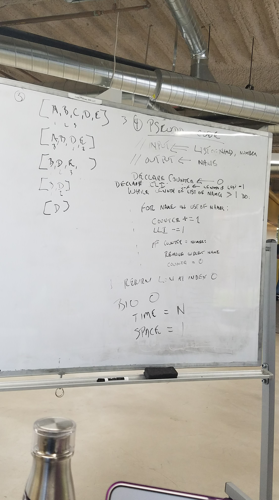

# Eeney Meeney Miney Moe
CF 401 Data Structures Whiteboard Challenge

Mock Interviews

## Challenge
People are standing in a circle playing Eeney Meeney Miney Moe. Counting begins at a specified point in the circle and proceeds around the circle in a specified direction. After a specified number of people are skipped, the next person is removed. The procedure is repeated with the remaining people, starting with the next person, going in the same direction and skipping the same number of people, until only one person remains, and wins the game.

Write a function called EeneyMeeneyMineyMoe() that accepts a list of strings and an int n. Start at the beginning of the list and count up to n and remove the person at the current index from the list. Keep counting from that index and count up to n over and over until only one person is left in the list. Return a string with the name of the last person left in the list.

Example:

n=3

[A, B, C, D, E]    // 1A, 2B, 3C

[A, B, _, D, E]    // C was removed

[_, B, _, D, E]    // A was removed

[_, B, _, D, _]    // E was removed

[_, _, _, D, _]    // B was removed

                   // only D is left

- Ask the candidate to write a function to execute the game described above.
- Help the candidate understand the rules of the game if he/she is unsure of it.
    - Feel free to share the example above to show an example
- Avoid utilizing any of the built-in methods available in your language.
- This problem can be solved using a queue:
    - The ideal solution is to enqueue and dequeue n number of times. once n is hit, remove that node from the queue completely.
        - This method takes O(n) time and uses O(1) extra space.

## Whiteboard
 (by Steven)

### Original Instructions
https://codefellows.github.io/common_curriculum/data_structures_and_algorithms/Code_401/class-15/interview-02.html

