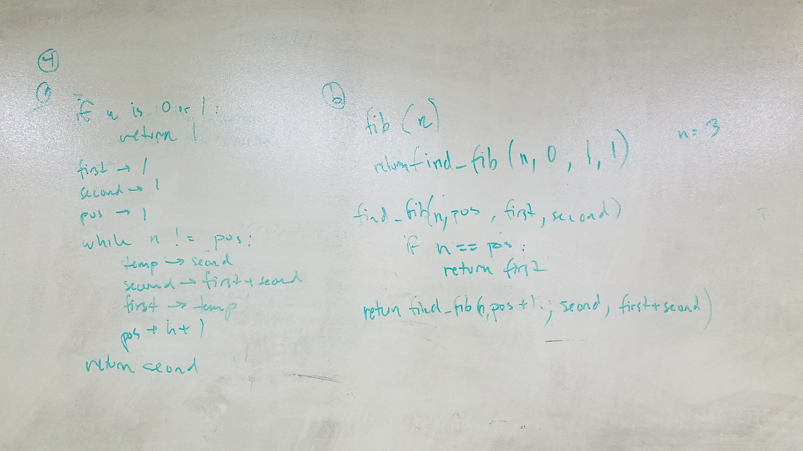
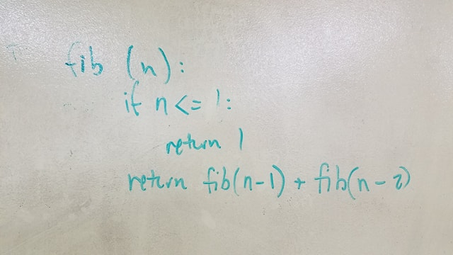

# Generate the nth Fibonacci number, 2 different ways.
CF 401 Data Structures Whiteboard Challenge

Mock Interviews

## Challenge
write a function to accepts an integer, and returns the nth number in the [Fibonacci Sequence](https://www.mathsisfun.com/numbers/fibonacci-sequence.html). You should be able to check their work for small values of n: if fib(n) is equal to fib(n-1) + fib(n-2). Work quickly towards a first solution, that is either recursive or iterative (with a while or for loop). Then solve it with the other approach.

Evaluate and compare the Big-O of both solutions:
- The recursive solution might be as bad as O(2n)—that’s 2 to the power of n— which is so bad most laptops would take a while to solve for n larger than about 40
- The iterative solution should be roughly O(n), which means a laptop could find answers for large values of n
- There is also an O(1) solution, based on a mathematical formula… Not likely anyone will know this without looking it up! (Did you see the formula on the page about the sequence linked above?) If time allows, try to implement the formula with the candidate.

## Whiteboard

### Original Instructions
https://codefellows.github.io/common_curriculum/data_structures_and_algorithms/Code_401/class-05/interview-02.html

### Katas
[CodeWars-noJS/Py](https://www.codewars.com/kata/fibonacci)

[CodeWars](https://www.codewars.com/kata/fast-fibonacci)
