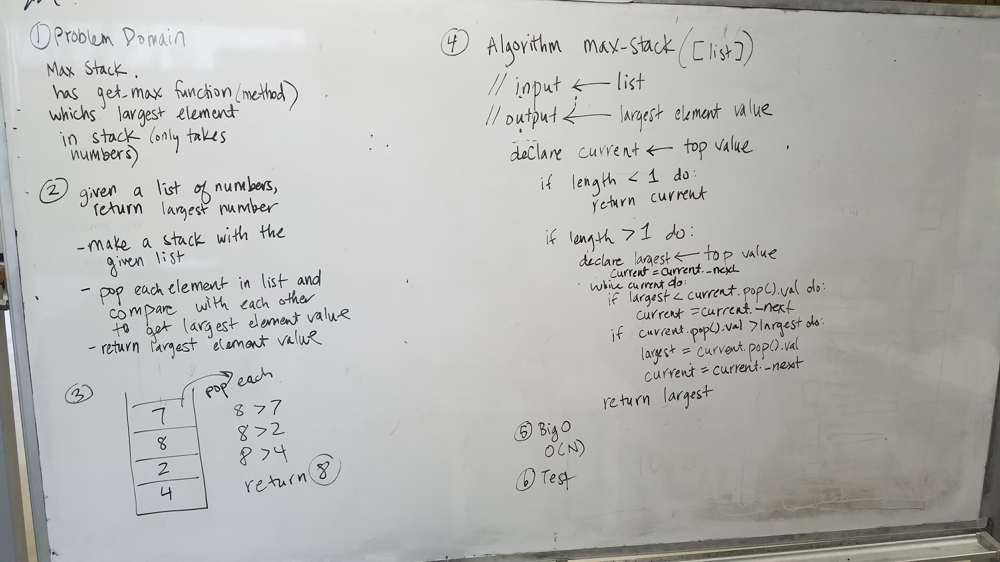

# Max stack. Write a method that returns the “biggest” element in a stack.
CF 401 Data Structures Whiteboard Challenge

Mock Interviews

## Challenge
- Ask the candidate to write a ‘Max Stack’ which is defined as a Stack with an additional getMax() member function which returns the ‘biggest’ element in the Stack.
- The candidate can assume that only numeric values will be stored in the Stack, but she/he has to ask before the interviewer can state this.
- The internal memory of the Stack can be approached in different ways.
    - Using a Linked List
        - This approach uses O(n) space.
    - Using an Array
        - This approach can either use O(n) space or O(c) where c is the size of the array in static-size arrays.
        - If your language doesn’t support dynamic arrays,Inquire about the candidate’s decision of using a limited amount of storage for the Stack.
    - Using a Node class and manually creating connections by maintaining a reference to the ‘top’ of the stack.
    - This approach uses O(n) space.
- This ‘getMax()’ member function can be approached in several ways as well:
    - Modifying the traditional push and pop methods to keep track on the maximum value so far.
        - This solution takes O(1) time to both maintain and retrieve the maximum value.
        - **Edit to original instructions** pop method is actually O(N) in the case that the value being popped is the max value.
    - Traversing the entire Stack to calculate the maximum value.
        - This solution takes O(n) time.
        - If the candidate is considering this approach, comment on the fact that there might be a more efficient way to calculate the maximum value, but avoid providing specific details.

## Whiteboard

### Original Instructions
https://codefellows.github.io/common_curriculum/data_structures_and_algorithms/Code_401/class-15/interview-01.html
