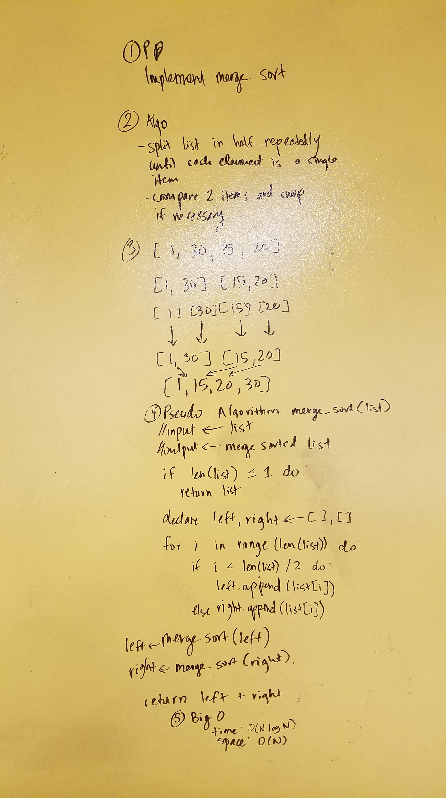

# Implement Mergesort
CF 401 Data Structures Whiteboard Challenge

## Challenge
Write a function that accepts an array of unsorted integers, and returns a sorted array by a recursive mergesort algorithm.

Write at least three test assertions for each method that you define.

### Example
Input: `[34, 19, 42, -9, 2018, 0, 2005, 77, 2099]`

Output: `[-9, 0, 19, 34, 42, 77, 2005, 2018, 2099]`

## Solution

