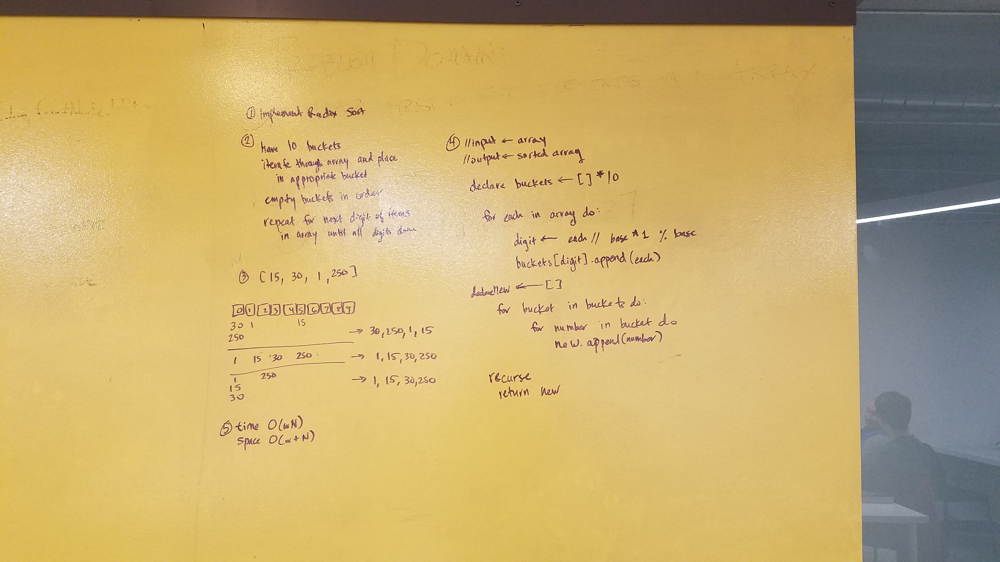

# Implement radix sort
CF 401 Data Structures Whiteboard Challenge

## Challenge
Write a function that accepts an array of positive integers, and returns an array sorted by a radix sort algorithm.

Write at least three test assertions for each method that you define.

## Solution

